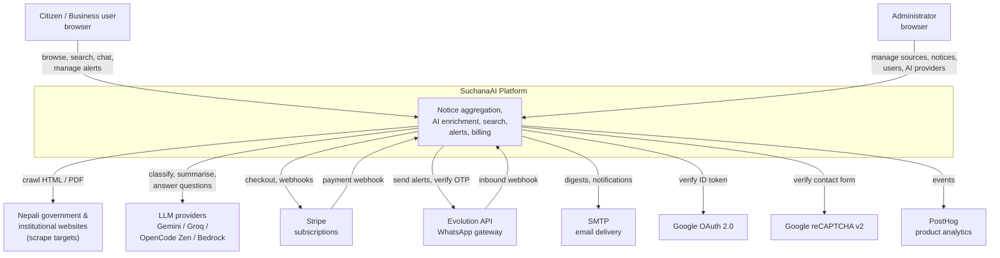
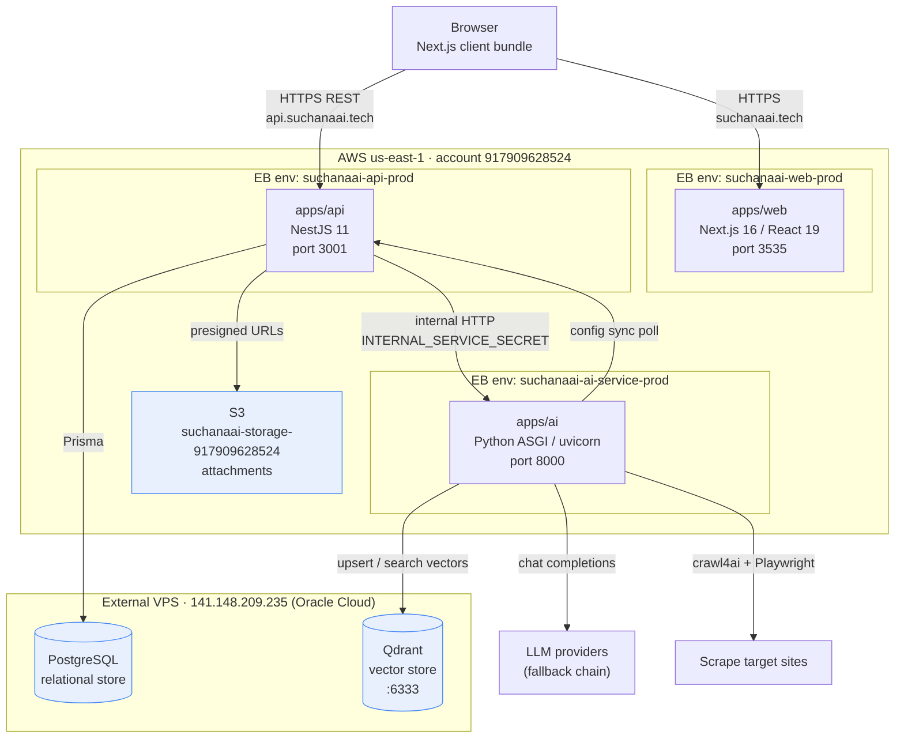
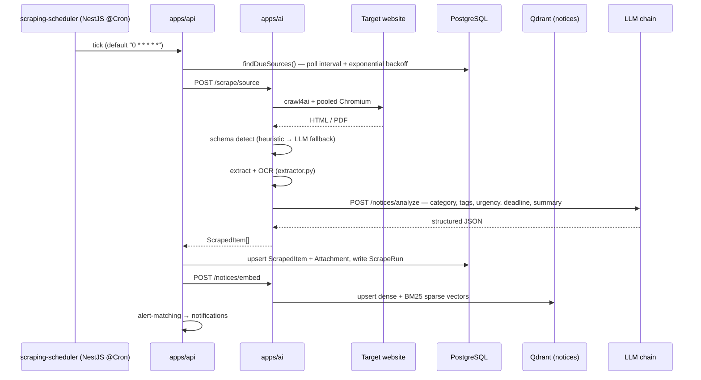
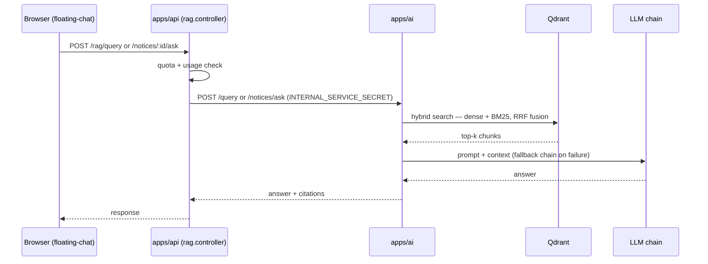
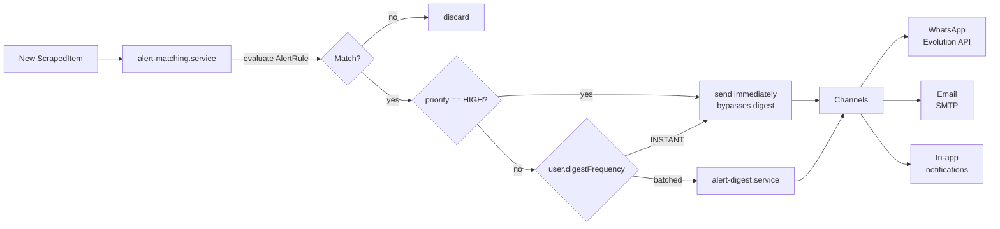
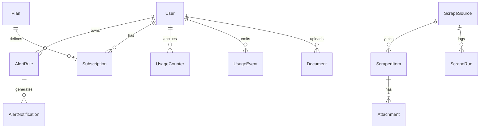
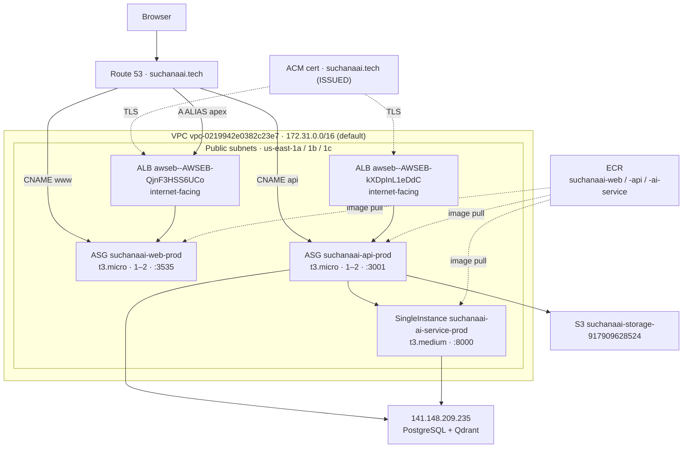
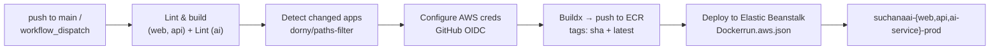

# SuchanaAI — Architecture Diagram Reference

Diagram-source document for **SuchanaAI** (`suchanaai.tech`), a public-notice
aggregation platform for Nepal. Every value here was read from the live codebase
or the running AWS account (`917909628524`, `us-east-1`) — not from memory.

Companion docs: `system-overview.md` (tech stack narrative),
`DEPLOYMENT_CHECKLIST_AWS_917909628524.md` (ops runbook),
`DOMAIN_HTTPS_CICD_SUCHANAAI_TECH.md` (domain/TLS/CI-CD values).

---

## 1. System context (C4 Level 1)

**Actors:** anonymous visitor, registered user (`FREE` / `PRO` / `MAX`), admin (`Role.admin`).

---

## 2. Container diagram (C4 Level 2)

Three deployable applications in a Turborepo monorepo, plus two data stores.

> **Note:** the browser never calls the AI service directly. `NEXT_PUBLIC_AI_URL`
> exists as a build arg but is not referenced by any web source file — the API
> proxies all AI traffic. This is a deliberate boundary: the AI service is
> unauthenticated at the network edge and guarded only by
> `INTERNAL_SERVICE_SECRET`.

### Container responsibilities

| Container | Tech | Port | Responsibility |
|---|---|---|---|
| `apps/web` | Next.js 16 (App Router), React 19, Tailwind v4, shadcn/ui | 3535 | SSR pages, client UI, i18n (en/ne), auth context, chat widget |
| `apps/api` | NestJS 11, Prisma, Passport JWT | 3001 | REST API, authN/Z, business rules, scrape scheduling, alerts, billing, AI proxy |
| `apps/ai` | Python, raw ASGI on uvicorn | 8000 | Scraping, OCR/PDF extraction, chunking, embeddings, RAG, LLM fallback chain |
| PostgreSQL | — | 5432 | System of record (16 models) |
| Qdrant | — | 6333 | Two collections: `documents`, `notices` |
| S3 | — | — | Notice attachments |

---

## 3. Component breakdown (C4 Level 3)

### 3.1 `apps/api` — NestJS

**Controllers (18)** — HTTP surface:

| Domain | Controllers |
|---|---|
| Public | `notices`, `documents`, `contact`, `health` |
| Auth/user | `auth`, `notifications`, `alerts`, `alert-channels` |
| AI | `rag`, `ai-providers` |
| Scraping | `scraping`, `attachments` |
| Billing | `billing` |
| Admin | `admin-users`, `admin-billing`, `admin-system`, `admin-whatsapp`, `settings` |

**Services (22)** — grouped by concern:

| Concern | Services |
|---|---|
| Notices & scraping | `notices`, `scraping`, `scraping-scheduler`, `documents`, `system-documents` |
| Alerts | `alerts`, `alert-matching`, `alert-digest`, `email-channel`, `notifications` |
| AI | `rag`, `ai-providers` |
| Identity | `auth`, `users` |
| Commerce | `plans`, `subscriptions`, `stripe`, `quota`, `usage` |
| Platform | `settings`, `contact` |

**Cross-cutting (`src/common/`)**

- `storage/s3-storage.service.ts` — S3 attachment upload/presign
- `cache/ttl-cache.ts`, `cache/single-flight.ts` — read-path caching + stampede control
- `crypto/secret-crypto.service.ts` — encrypts provider API keys under `SETTINGS_ENCRYPTION_KEY`
- `http/axios-correlation.ts` — propagates `x-request-id` to the AI service
- `token-revocation.service.ts` — JWT denylist (`RevokedToken`)
- `maintenance.middleware.ts` — maintenance-mode gate

**Guards / strategies:** `jwt-auth.guard`, `optional-jwt-auth.guard`, `roles.guard`, `jwt.strategy`

**Webhooks / integrations:** `webhooks/whatsapp-webhook.controller.ts`, `integrations/evolution/evolution-api.service.ts`

### 3.2 `apps/ai` — Python ASGI

| Module | Role |
|---|---|
| `main.py` | ASGI router (hand-rolled, no framework) |
| `scraper.py` | crawl4ai orchestration, schema detection (heuristic → LLM fallback), retry/backoff |
| `browser_pool.py` | Shared pooled Chromium, semaphore-bounded, self-healing |
| `extractor.py` | PDF / OCR text extraction |
| `chunker.py` | Chunking — `CHUNK_SIZE=800`, `CHUNK_OVERLAP=120` |
| `embeddings.py` | `intfloat/multilingual-e5-base`, 768-dim, batch 32 |
| `store.py` / `notice_store.py` | Qdrant collections `documents` / `notices` |
| `rag.py` / `notice_rag.py` | Retrieval + answer synthesis |
| `llm.py` | Provider fallback chain + health probes |
| `clarify.py` | Query clarification |
| `ai_config_sync.py` | Polls API for admin-managed provider config |
| `secure_http.py` | SSRF-guarded outbound HTTP |
| `progress.py` / `scrape_progress.py` | Job progress, SSE streaming |
| `metrics.py`, `logger.py`, `config.py` | Observability and settings |

**HTTP endpoints (18)**

| Group | Endpoints |
|---|---|
| Meta | `GET /`, `GET /health`, `GET /llm/health`, `POST /llm/providers/refresh` |
| Documents | `GET/POST /documents`, `POST /query`, `GET /progress` |
| Notices | `POST /notices/analyze`, `/notices/ask`, `/notices/embed`, `/notices/search`, `/notices/extract-pdf`, `/notices/delete` |
| Scraping | `POST /scrape/source`, `/scrape/check`, `/scrape/listing/check`, `/scrape/sitemap/detect`, `/scrape/sitemap-crawl` |

### 3.3 `apps/web` — Next.js

**Routes (27)**

| Group | Routes |
|---|---|
| Public | `/`, `/about`, `/contact`, `/pricing`, `/privacy`, `/demo`, `/notices`, `/notices/[slug]`, `/documents` |
| Auth | `/login` |
| User | `/dashboard`, `/dashboard/activity`, `/dashboard/alerts`, `/dashboard/billing`, `/dashboard/saved`, `/dashboard/settings` |
| Admin | `/admin`, `/admin/ai`, `/admin/alerts`, `/admin/categories`, `/admin/contact`, `/admin/notices`, `/admin/plans`, `/admin/scraping`, `/admin/settings`, `/admin/sources`, `/admin/system`, `/admin/users` |

**State (`lib/`)** — React contexts `auth-context`, `alerts-context`, `language-context`, `notice-context`; Zustand `chat-store` (chat history survives navigation, clears on hard refresh); `api.ts` (`API_URL` from `NEXT_PUBLIC_API_URL`).

---

## 4. Key data flows

### 4.1 Automated scraping → embedded notice

Deleting a notice calls `POST /notices/delete` so vectors never orphan.

### 4.2 RAG chat

Routing is notice-scoped by default; it falls back to the general corpus only on an explicit general-corpus signal.

### 4.3 Alert delivery

`AlertRule` matching dimensions: `categories` and/or `tags` (at least one required), then optional `keywords`, `excludeKeywords`, `organizations`, `minUrgency`, `deadlineWithinDays`.

### 4.4 Authentication

Google OAuth ID token or email/password → NestJS `auth.service` issues JWT
(`JWT_EXPIRES_IN=7d`) → `jwt.strategy` validates → `roles.guard` enforces
`Role.admin` → logout writes to `RevokedToken` denylist. Admin elevation is
driven by the `ADMIN_EMAILS` allowlist.

---

## 5. LLM provider fallback chain

Tried in order; the first healthy provider answers. Admin panel `/admin/ai` is the
source of truth, synced to the AI service by `ai_config_sync.py`; env vars are
fallback defaults only.

| # | Slug | Kind | Notes |
|---|---|---|---|
| 1 | `gemini` | `GEMINI` | Google Gemini |
| 2 | `groq` | `OPENAI_COMPATIBLE` | Groq |
| 3 | `opencode` | `OPENAI_COMPATIBLE` | OpenCode Zen |
| 4 | `bedrock` | `BEDROCK` | AWS Bedrock (Claude). Wired end-to-end but **not usable** — the account lacks Claude model entitlement; requires an AWS support case. |

`AiProvider` rows store `kind`, `baseUrl`, `region`, `model`, and an API key
encrypted with `SETTINGS_ENCRYPTION_KEY`.

---

## 6. Data model

**16 models:** `User`, `AlertRule`, `AlertNotification`, `Document`,
`ScrapeSource`, `ScrapedItem`, `Attachment`, `ScrapeRun`, `AppSetting`,
`ContactMessage`, `AiProvider`, `Plan`, `Subscription`, `UsageCounter`,
`UsageEvent`, `RevokedToken`.

**15 enums:** `Role`, `UserStatus`, `AlertPriority`, `AlertUrgency`,
`DigestFrequency`, `AlertNotificationStatus`, `DocumentStatus`,
`ScrapedItemCategory`, `ScrapeRunStatus`, `ScrapePaginationType`,
`ContactMessageStatus`, `AiProviderKind`, `PlanTier` (`FREE`/`PRO`/`MAX`),
`SubscriptionStatus`, `UsageMetric`.

**Vector collections (Qdrant):** `documents` (user uploads),
`notices` (scraped notices) — 768-dim dense + BM25 sparse, RRF fusion.

---

## 7. AWS deployment topology

### Deployed values

| Item | Value |
|---|---|
| Account / region | `917909628524` / `us-east-1` |
| VPC | `vpc-0219942e0382c23e7` — `172.31.0.0/16` (default VPC) |
| Subnets | `subnet-0be99c7e334385fbb` (1a, `172.31.0.0/20`), `subnet-087aad32fdb8bb22f` (1b, `172.31.80.0/20`), `subnet-0f98d350be8673bd6` (1c, `172.31.16.0/20`) — all public |
| EB application | `suchanaai` |
| Web env | `suchanaai-web-prod` · LoadBalanced ALB · t3.micro · 1–2 · `:3535` · health `/` → 200 |
| API env | `suchanaai-api-prod` · LoadBalanced ALB · t3.micro · 1–2 · `:3001` · health `/health` → 200 |
| AI env | `suchanaai-ai-service-prod` · SingleInstance · t3.medium · `:8000` |
| ALB (web) | `awseb--AWSEB-QjnF3HSS6UCo` |
| ALB (api) | `awseb--AWSEB-kXDpInL1eDdC` |
| ECR | `suchanaai-web`, `suchanaai-api`, `suchanaai-ai-service` |
| S3 (app) | `suchanaai-storage-917909628524` |
| S3 (EB bundles) | `elasticbeanstalk-us-east-1-917909628524` |
| S3 (build) | `suchanaai-build-917909628524` |
| Certificate | ACM `suchanaai.tech`, DNS-validated, `ISSUED` |

### DNS

| Record | Type | Target |
|---|---|---|
| `suchanaai.tech` | A (ALIAS) | web ALB `awseb--awseb-qjnf3hss6uco-...` |
| `www.suchanaai.tech` | CNAME | `suchanaai-web-prod.eba-j3cvke4q.us-east-1.elasticbeanstalk.com` |
| `api.suchanaai.tech` | CNAME | `suchanaai-api-prod.eba-j3cvke4q.us-east-1.elasticbeanstalk.com` |

> **Architectural caveats worth drawing:** (1) the AI service is a **single
> instance with no load balancer** — a genuine SPOF, sized t3.medium for the
> embedding model plus headless Chromium; (2) PostgreSQL and Qdrant run
> **outside AWS** on an Oracle Cloud VPS, so the primary data path leaves the
> VPC; (3) the default VPC is used with public subnets only — there is no
> private-subnet tier.

---

## 8. CI/CD pipeline

- Workflow: `.github/workflows/ci-cd.yml`; composite actions
  `.github/actions/build-push-ecr` and `.github/actions/deploy-beanstalk`.
- Auth: **GitHub OIDC only — no static AWS keys.** Repo secret
  `AWS_DEPLOY_ROLE_ARN` → role `suchanaai-github-deploy`.
- Trust policy matches GitHub's **immutable numeric IDs**:
  `repo:ashokabbhattarai-byte@228275133/suchanaai@1343324102:{environment:production | ref:refs/heads/main}`.
  The plain `owner/repo` form silently fails.
- Jobs are per-app and independently skippable; `force_all` deploys all three.
- `NEXT_PUBLIC_*` are **build-time** args baked into the web image — changing one
  requires a rebuild, not an env-var update. They live as GitHub **environment
  variables** under `production`, not repo variables.

> **Non-obvious behaviour:** Elastic Beanstalk performs its S3 and Auto Scaling
> work using the **caller's** credentials, not the EB service role. The deploy
> role therefore needs the full EB S3 action set (including `GetObjectAcl`,
> `PutObjectAcl`, `DeleteObject`) on the EB bundle bucket, plus
> `AdministratorAccess-AWSElasticBeanstalk` for the EC2/ASG/ELB layer. The EB
> bundle bucket must keep `ObjectOwnership=ObjectWriter` — setting
> `BucketOwnerEnforced` breaks EB config writes with `The bucket does not allow ACLs`.

---

## 9. Security model

| Boundary | Control |
|---|---|
| Browser → API | JWT bearer (7d) + `RevokedToken` denylist; strict CORS from `WEB_ORIGIN` (comma-separated); CSRF origin/referer check on state-changing requests |
| API → AI | `INTERNAL_SERVICE_SECRET` shared secret; AI service is not internet-facing by design |
| Admin routes | `roles.guard` + `ADMIN_EMAILS` allowlist |
| Secrets at rest | Provider API keys encrypted with `SETTINGS_ENCRYPTION_KEY` (rotating it orphans stored keys) |
| Outbound from AI | `secure_http.py` SSRF guard; SMTP restricted by `SMTP_ALLOWED_PORTS` / `SMTP_ALLOW_PRIVATE_HOSTS` |
| CI → AWS | OIDC federation, short-lived credentials, no static keys |
| Contact form | reCAPTCHA v2 |
| Boot-time | API refuses to start on a weak/missing `JWT_SECRET` |

---

## 10. Drawing checklist

Nodes to place: **3 app containers**, **3 data stores** (PostgreSQL, Qdrant, S3),
**2 ALBs**, **3 EB environments across 3 AZs**, **1 VPC**, **ECR**, **Route 53 + ACM**,
**7 external SaaS** (LLM chain, Stripe, Evolution, SMTP, Google OAuth, reCAPTCHA, PostHog),
**GitHub Actions**.

Edges that matter most: browser→web, browser→api, api→ai (one-way + config-sync
back), api→PostgreSQL, ai→Qdrant, ai→LLM, ai→scrape targets, api→S3, CI→ECR→EB.

Emphasise in the diagram: the **API-as-sole-gateway** boundary (browser never
reaches AI), the **single-instance AI SPOF**, and the **data tier living outside
AWS**.
